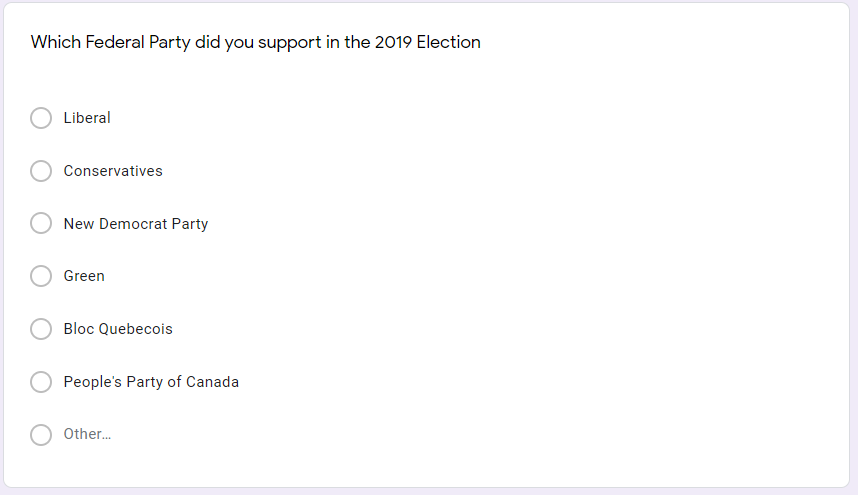

```{r setup, include=FALSE}
knitr::opts_chunk$set(echo = FALSE, fig.pos = 'H')

# install.packages("tidyverse")
library(tibble)
library(dplyr)
library(ggplot2)
require(scales)

survey_data <- read.csv("./assets/simulated.csv")


```


# Executive summary

Petit Poll has been asked by the Liberal Party of Canada to survey Canada in 
order to understand whether the party was likely to continue to gain support and
retain the support of voters in Canada if the Liberal Party of Canada chose to 
support the decriminalization of narcotics in Canada in order to combat Canada's
growing drug crisis. By using social media, we surveyed Canadians in each province and territory
in order to gain insight on the current views and knowledge of Canadians on this
subject. We found that there is a split in Canadian support of the decriminalization 
of narcotics within Canada. Furthermore, a significant portion of Canadians are 
undecided. It is relevant because this could provide a potential avenue for the 
Liberal Party of Canada to tackle a prevalent issue within Canada with a currently
controversial solution. By providing more information to the public in regards to 
the decriminalization of narcotics, there is potential for the party to gain
popular votes through pushing for decriminalization. Unfortunately the simulated
data was generic and specific insight was not as significant as imagined. In the future, more effort
into simulating data to provide a report through demographic research and the use of Stan
can provide more accurate simulations. Furthermore, this survey completed over a
period of time can provide feedback on the effect of educating Canadians on 
decriminalization of narcotics and confirm if it will provide the Liberal Party of Canada
more support in the 2023 election. 


# Introduction

In 2019, the Canadian federal election resulted in a tight result, with the Liberal
Party of Canada winning as a minority government. One of the many controversies
that surfaced approaching the election was the decriminalization of narcotics in 
Canada. Although the Liberal Party was shown to be heavily in favor of supporting
the motion, stigma and misinformation from an opposing party caused the Liberal 
Party to retract their support and instead focus battling the drug crisis in Canada
through funding recovery programs (Harris, 2019). Interestingly, it was found that
by educating Canadians on the effects of decriminalizing narcotics, the Liberal 
Party of Canada can erase stigma and overcome misinformation, gaining a larger
support base in the next election. 

We surveyed each province and territory within Canada to gain an insight in various 
locations in Canada, however, focus was placed on Ontario, Quebec and British Columbia 
as these locations were not dominated by a specific party in the last election, 
and they also contain a large portion of available seats to be won. Each of the 3
provinces provide an opportunity for the Liberal Party to a significant amount of votes.
By performing consistent monthly polling, as well as a focus on educating the public
about the decriminalizing of narcotics, the Liberal Party of Canada should be able
to gain insight on Canada's overall views on the topic. Specifically, it can be known
how much supporters they can gain as well as lose should the Liberal Party openly
support decriminalizing narcotics. This report will cover the survey methods, followed by
an analysis of the data with possible implications. However, the simulated data prevents
detailed conclusions which needs to be improved on, however possible implications are 
considered. 

# Discussion 

## Survey methodology 

Decriminalization of drugs is a matter that is not only concerning for potential users of the drugs, but also for their families, peers, and loved ones.  As such, this is something that greatly impacts the nation as a whole, so it is appropriate to set the population of the survey to be all Canadian citizens.
The frame of the population was every individual that carries a  Canadian citizenship. The sample of this survey was individuals from all provinces in the country. Based on the past discussions, polls, and the results of other countries that have decriminalized drugs, the debate on this matter is rather a popular controversial topic with a relatively even distribution across both sides globally. Thus, we wanted to survey people from across the country to minimize selection bias.

The sampling method of choice was stratified sampling by province. Due to varied population sizes and drug-related incidents per province, the idea of decriminalizing drugs can be different based on people’s relative experiences of the same region. To make sure members from every province is heard, stratified sampling is the preferred method in this scenario.

To reach the participants, the survey was sent to every citizen through social media ads catered specifically towards Canadian accounts. This is to ensure that members of the frame were included and no members outside of the target frame were supposed to get hold of the survey. Additionally, the convenience of conducting a survey online meant that users are able to complete it quickly during their free time, in hopes of getting a higher response rate. Collecting responses of online surveys was also an automatic process, which was more reliable and less tedious compared to other surveying methods such as through mail or phone calls. Despite these advantages, there is a risk that the same person could own multiple social media accounts and complete the survey multiple times. To avoid accounting for such potential duplicates, we only include a certain amount of responses in our analysis as part of our stratification.

Although online surveys were very convenient, it did not come without a cost. From accessing enormous databases of email addresses to allocating massive amounts of storage for incoming responses, the total cost of surveying 200 000 individuals and collecting 199 000 responses was around $238 800.

Due to many heated discussions already present online about this decriminalization of drugs, we hoped to see a high response rate about this matter. This is certainly a topic in which people who do care are very one-sided, especially if it affects them or their colleagues/peers personally. As such, we have treated non-respondents as people who have no opinion on the matter either because they are uninformed about decriminalization of drugs, or people that know about it but do not care about it.

In light of protecting participants and their opinions, we did not ask any personal questions, nor anything related to their contact information. As a result, the survey is completed anonymously, and all the questions are about the participant’s opinion about the topic and nothing else.


## Results

The survey simulated survey reached 200000 people and was completed by 199000 people in Canada spread out within all provinces and territories. The responses were mostly completed with over 39000 or about 20% of the results contain one or more columns of incomplete data. Regarding the question about the party votes, 40% of the surveyed people supported the Liberal party in the 2019 federal election and 37% voted for the Conservatives with the rest of the votes spread out in other parties (more details in figure 3) and only about 2 percent of those surveyed did not answer. Since the survey was stratified across the provinces and territories, there was a proportional distribution of surveys completed in each province and territory. The overall familiarity of Canadian citizens was 2, indicating that most Canadians have heard about and are aware of the idea of decriminalizing narcotics in Canada but are not aware of all the implications. Very few people have never heard of this topic and not many people are well researched either, most people are in the familiar and unfamiliar category (figure 1). The overall support for the decriminalization of narcotics in Canada was slightly positive in the simulated results, leading to inconclusive results. About 39% of Canadians were supportive of decriminalization, 35% were against and the remaining 26% are undecided/unsure (figure 2). About 90% of the simulated results were in support of further education into this topic. There was also a wide range of age ranges simulated, with 14% empty responses. All the results were simulated to represent Canada's demographics as of 2016, and 2019 voting results with some rounding and a certain amount of non-responses in consideration.

The results suggest that Canada is very split about decriminalization of narcotics (figure 2). The simulation suggests that about a quarter of the country is still unsure about whether they support a possible notion of decriminalizing narcotics. This is significant as it implies that a large amount of support can be potentially gained or lost. These results are similar to a survey done by Ipsos in January 2020 (Simpson, 2020), which concluded that 47% of Canadians support the decriminalization of narcotics while 53% of Canadians are against a potential decriminalization. However, that survey suggested that 31% Canadians are only somewhat supportive whereas 26% of Canadians are somewhat against. This implies that up to 50% of the Canadian population can be persuaded to support either side, higher than the simulated 26% of Canadians. Since a large portion of Canadians support further education into this topic, there is potential to educate Canadians into supporting such a notion going forward into the next election. 

Specific to the Liberal Party of Canada (figure 5), there is a split on the supporters in the simulated data although evidence suggests that actual supporters may be more supportive than simulation. In an article about the topic from CBC (Harris, 2019), it was suggested that the Liberal Party was heavily in favor of supporting the decriminalization of narcotics within Canada to publicly battle drug issues across the country, this was backed by several health organizations including the Toronto City Health Department as well as many youth delegates. This implies that the Liberal party will likely not lose a significant part of the party's supporters, however, it also suggests that the Liberal party would not gain supporters either. 

A large part of winning elections is through gaining support of provinces with a majority of seats, specifically Ontario, Quebec and British Columbia. Despite stratifying by province, there is little difference in opinions between each province in the simulated data between these 3 provinces (figure 4). It is worth noting that the simulated data showed that Ontario had the highest support for decriminalization of narcotics, which can be significant as Ontario holds the most seats in Canada and it was a largely split vote in the last provincial election. In previous surveys (Simpson, 2020) British Columbia posted 51% support for the decriminalization of narcotics. This result is noteworthy as Vancouver is currently battling a losing battle against a drug crisis (BC Coroners Service, 2020) with hundreds of overdoses a month. The government of British Columbia along with the city of Vancouver has been battling their opioid crisis for years now, with varying results, and many organizations has been educating and campaigning for the decriminalization of narcotics as a method to fight the increasing amounts of overdoses and drug possession charges. The large amount of support in British Columbia can indicate possible support within other provinces as well. 

With more detailed data, it can be determined how serious Canadians view the drug crisis in Canada, and how that effects their opinions (Figure 8). Currently there are no noticeable disparities between age groups and their support of decriminalizing narcotics however with more detailed data there should start to be a noticeable difference as suggested by (Harris, 2019), as many youth delegates are advocating support. Furthermore Simpson (2020) showed that the older age group are more resistant to the idea compared to a younger group. Further education could potentially cause polarization of opinions, likely against decriminalization in an elderly age group.

With more education on the topic of decriminalizing narcotics in Canada, there should be a shift to a where most people are familiar on the topic, hopefully lowering the amount of unsure responses and gain more support or opposition on decriminalizing narcotics unlike the responses showed in Figure 7. Given as such, charts such as Figure 9 should show an increase on average. People might perceive drug use to be more common if there was an increase in information provided about the drug crisis happening in various cities in Canada, so this field can be used to track information spread especially if education programs were targeted at specific provinces first to test effectiveness.

In addition, the CBC article (Harris, 2019) reference previously noted that the Liberal Party's reluctance to openly support the decriminalization of narcotics in Canada is due to the stigma against the idea. The Conservative party mislead voters ahead of the 2019 election by blurring the definition of legalization and decriminalization. Further education in the difference between the 2 terms, which a projected majority of Canadians support further education into the subject (figure 6) could mean erasing the stigma against decriminalization narcotics. By increasing the general Canadian population's knowledge of the pros and cons of decriminalization of narcotics as well as learning from previous cases of successful attempts (such as in Portugal) (Drug Policy Alliance, 2020) the Liberal Party of Canada can potentially educate voters and gain further support to win a majority election in 2023. A recent article by Public Health Ontario suggested that drug use has increased dramatically since the COVID-19 pandemic started (Public Health Ontario, 2020). This can potentially be a good time to target a drug crisis by introducing new methods of fighting the crisis through decriminalization. This survey can be continuously used to poll any changes in opinion of Canadians as the Liberal Party of Canada introduces education programs to inform Canadians on the many aspects involved in decriminalizing narcotics. Should there be an increase of support then the party can consider openly supporting and pushing for the decriminalization of narcotics within Canada.


The raw data can be found here: [https://raw.githubusercontent.com/JamesBond0014/STA304_PS2/master/assets/simulated.csv](https://raw.githubusercontent.com/JamesBond0014/STA304_PS2/master/assets/simulated.csv)

The code that generates the simulated data can be found here:[https://github.com/JamesBond0014/STA304_PS2/blob/master/simulation.R](https://github.com/JamesBond0014/STA304_PS2/blob/master/simulation.R)

The R markdown file that generated this report and included graphs are located here:[https://github.com/JamesBond0014/STA304_PS2/blob/master/ps2.Rmd](https://github.com/JamesBond0014/STA304_PS2/blob/master/ps2.Rmd)

## Weakness and areas for future

There are a few weaknesses within our survey. Firstly, our method of sampling may
not reach a fully unbiased sample as we survey through social media online, which 
may gain a younger audience, and since previous survey show that younger people
are more likely to support decriminalization of narcotics, this would give a biased
response rate. We tried to compensate by asking for ages in order to better adjust 
for any biases. Another weakness is the simulated data. We may also survey people who
fall outside of our targeted frame as we have limited control of our sample population
if we do the survey online. We may also get more results from strongly opinionated individuals
and miss out on the average citizen and some individuals may complete the survey multiple times
We tried to simulate stratification
but giving some unique characteristics of each strata (province) however limited 
information prevented us from making reasonable assumptions. The possibly unrealistic
and generalized data prevented significant conclusions to be made. This leads to
another weakness, which is that variables that should be correlated were fairly
unrelated in our survey. For example, younger people vs older people should support
the stance differently as well as Liberal voters vs Conservative voters. 

In the future, more research into demographics and previous research done in overall
support for the decriminalization of narcotics could lead to more accurate results
as well as using STAN in order to generate correlated data to show significant voter
distributions. In this report, we used previous research to back up and influence
certain conclusions in order to provide a more realistic conclusion, which may contradict
simulated data. We can also move to a more official polling method and abandon using
social media, although social media does offer quick and large sample populations. 
Another step would be to try different wordings of decriminalizing narcotics and
explore different levels of decriminalization. Voters may have various views depending on 
drug possession, use or distribution decriminalization. 

\newpage

# References
  
  BC Coroners Service, (2020). Illicit Drug Toxicity Deaths in BC,
  https://www2.gov.bc.ca/assets/gov/birth-adoption-death-marriage-and-divorce/deaths/coroners-service/statistical/illicit-drug.pdf
  
  Drug Policy Alliance, (2020). Drug Decriminalization,
  https://www.drugpolicy.org/issues/drug-decriminalization
  
  Harris, K. (2019). Scheer suggests Liberals could decriminalize hard drugs, despite Trudeau's denial,
  https://www.cbc.ca/news/politics/scheer-trudeau-decriminalization-drugs-1.5324106
  
  Public Health Ontario. (2020).  Rapid review: substance use-related harms and risk factors during periods of disruption,
  https://www.publichealthontario.ca/-/media/documents/ncov/main/2020/08/substance-use-related-harms-disruption.pdf?la=en
  

  Simpson, S. (2020). Canadians Split on Decriminalization of Possession of Narcotics, Prostitution,
  https://www.ipsos.com/en-ca/news-polls/Canadians-Split-On-Decriminalization-of-Possession-of-Narcotics-Prostitution
  
  Wickham et al., (2019). Welcome to the tidyverse. Journal of Open Source Software, 4(43), 1686,
  https://doi.org/10.21105/joss.01686

\newpage

# Appendix

Click here to view the Survey [https://forms.gle/EHCwMyezBMeerhNt8](https://forms.gle/EHCwMyezBMeerhNt8)

```{r, fig.cap = "How familiar people were with decriminalization of drugs"}
survey_data %>%
  select(familiarity) %>%
  ggplot(aes(x=familiarity)) +
  geom_bar()+
  scale_y_continuous("Number of People") + 
  scale_x_discrete("Familiarity of decriminalization of drugs") + 
  ggtitle("Distribution of knowledge of decriminalization of drugs")


```

```{r, fig.cap = "Support of decriminalization"}

#parse data
general_vote <- data.frame(table(survey_data$opinion)) %>%
  rename(
    Vote_Option = Var1,
    Vote_Count = Freq
  )

total_vote<-sum(general_vote$Vote_Count)
general_vote %>%
  ggplot(aes(x="", y=Vote_Count, fill=Vote_Option)) +
  geom_bar(width = 1, stat = "identity") +
  theme_void() + 
  coord_polar("y", start=0)+
  geom_text(aes(label = paste0(round(Vote_Count/total_vote*100), "%")), 
            color="black",position = position_stack(vjust = 0.5)) +
  ggtitle("Support of decriminalization of drugs")

```

```{r, fig.cap = "Votes for each party"}
general_vote <- data.frame(table(survey_data$party)) %>%
  rename(
    Vote_Option = Var1,
    Vote_Count = Freq
  )
total_vote<-sum(general_vote$Vote_Count)
general_vote %>%
  ggplot(aes(x=Vote_Option, y=Vote_Count)) +
  geom_bar(stat = "identity") +
  geom_text(aes(label = paste0(round(Vote_Count/total_vote*100), "%")), 
            color="black",position = position_stack(vjust = 0.5)) +
  ggtitle("Support of party in 2019")+
  scale_x_discrete("Party") +
  scale_y_continuous("Votes")

```

```{r, include=FALSE}

#function to graph grouped bar charts
grouped_bar_chart <- function(data, xlab, ylab, title){
  ggplot(data, 
       aes(y=grouped, x=value, fill=category, label=category))+
  geom_bar(stat="identity",position="dodge", width=0.8) +
  scale_x_continuous(ylab) + 
  scale_y_discrete(xlab) + 
  ggtitle(title)
}
```

```{r, fig.cap = "Support of decriminalization by Province"}

#data parsing into format I want for chart
grouped_votes <- survey_data %>%
  count(province, opinion) %>%
  rename(
    count=n
  )
total_vote <- aggregate(grouped_votes$count, 
                        by=list(province=grouped_votes$province), FUN=sum)

grouped_votes<-left_join(grouped_votes, total_vote, by="province") %>%
  rename(total=x) %>%
  mutate(value=count/total) %>%
  rename(grouped=province, category=opinion)

grouped_bar_chart(grouped_votes, "Province", "Vote pecentage", 
                  "Support of Decriminalization of drugs by province")
```

```{r, fig.cap="Support of decriminalization by Party"}
#data parsing into format I want for chart

grouped_votes <- survey_data %>%
  count(party, opinion) %>%
  rename(
    count=n
  )
total_vote <- aggregate(grouped_votes$count, 
                        by=list(party=grouped_votes$party), FUN=sum)

grouped_votes<-left_join(grouped_votes, total_vote, by="party") %>%
  rename(total=x) %>%
  mutate(value=count/total) %>%
  rename(grouped=party, category=opinion)

grouped_bar_chart(grouped_votes, "Party", "Vote pecentage", 
                  "Support of Decriminalization of drugs by Party")

```

```{r, fig.cap="Province's support of education into decriminalization"}
#data parsing into format I want for chart

grouped_votes <- survey_data %>%
  count(province, educate) %>%
  rename(
    count=n
  )
total_vote <- aggregate(grouped_votes$count, 
                        by=list(province=grouped_votes$province), FUN=sum)

grouped_votes<-left_join(grouped_votes, total_vote, by="province") %>%
  rename(total=x) %>%
  mutate(value=count/total) %>%
  rename(grouped=province, category=educate)
grouped_bar_chart(grouped_votes, "Province", "Vote pecentage", 
                  "Support of Education on decriminalization 
                  of drugs by province")
```

```{r, fig.cap="Familiarity in Canada"}
#data parsing into format I want for chart

grouped_votes <- survey_data %>%
  count(familiarity, opinion) %>%
  rename(
    count=n
  )
total_vote <- aggregate(grouped_votes$count, 
                        by=list(familiarity=grouped_votes$familiarity), FUN=sum)


grouped_votes<-left_join(grouped_votes, total_vote, by="familiarity") %>%
  rename(total=x) %>%
  mutate(value=count) %>%
  rename(grouped=familiarity, category=opinion)

grouped_bar_chart(grouped_votes, "Familiarity", "Votes", 
                  "Support of Education on decriminalization 
                  of drugs by familiarity") 
```

```{r, fig.cap="Age group support of decriminalization"}
#data parsing into format I want for chart

grouped_votes <- survey_data %>%
  count(age, opinion) %>%
  rename(
    count=n
  )
total_vote <- aggregate(grouped_votes$count, 
                        by=list(age=grouped_votes$age), FUN=sum)

grouped_votes<-left_join(grouped_votes, total_vote, by="age") %>%
  rename(total=x) %>%
  mutate(value=count/total) %>%
  rename(grouped=age, category=opinion)
grouped_bar_chart(grouped_votes, "Age Group", "Vote pecentage", 
                  "Support of Education on decriminalization 
                  of drugs by age")
```


```{r, fig.cap="Perceived Drug Usage"}
#filter outliers generated by simulation
grouped_votes <- survey_data %>% filter(usage<=40) %>% select(c(province, usage))
grouped_votes$usage %>%
  aggregate(by=list(province=grouped_votes$province), FUN=mean) %>%
  ggplot(aes(x = province, y=x)) +
  geom_bar(stat="identity") +
  scale_x_discrete("Provinces") +
  scale_y_continuous("Average perceived drug use")+
  ggtitle("Perceived drug usage by province")


```


\newpage





